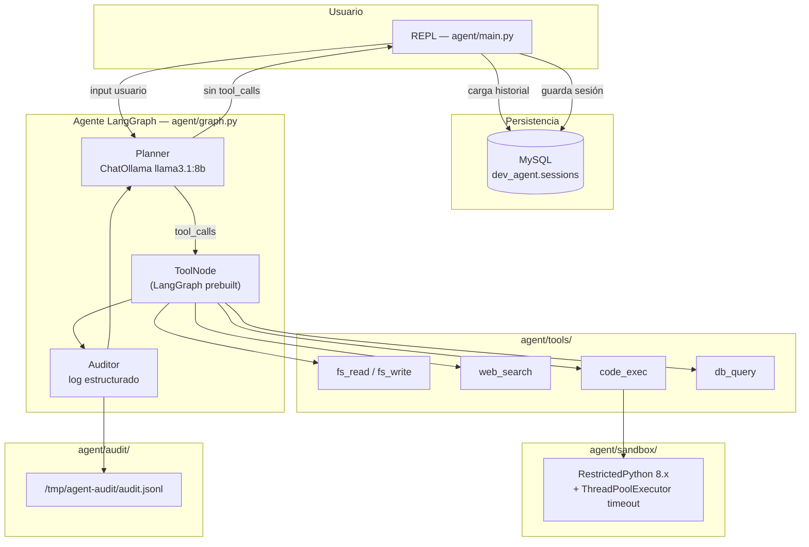
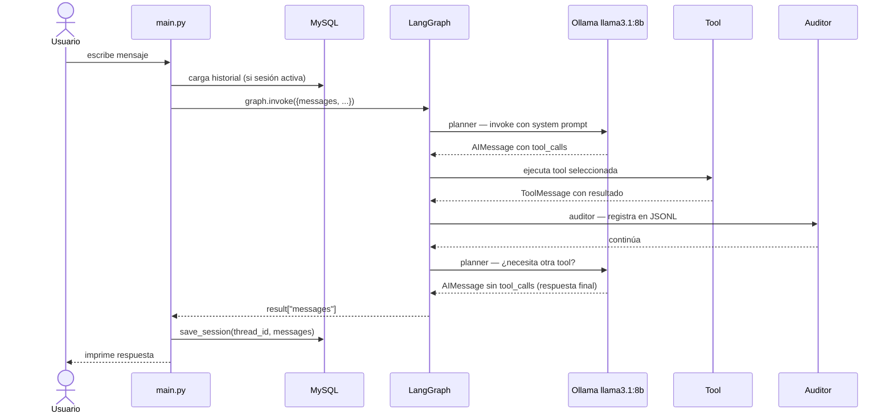
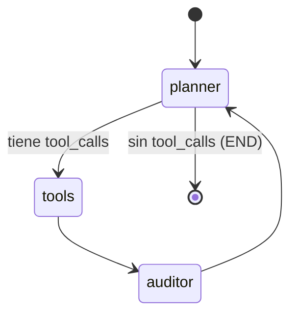

# Arquitectura

## Visión general del sistema



## Flujo de un turno completo



## Nodos del grafo LangGraph



## Estado compartido (`AgentState`)

```python
class AgentState(TypedDict):
    messages    # historial completo (Human + AI + Tool messages)
    tool_calls  # calls realizados en la sesión actual
    current_tool
    tool_result
    audit_log   # entradas del auditor en este turno
    iteration   # contador de ciclos
    error
```

## Stack tecnológico

| Capa | Tecnología |
| --- | --- |
| Orquestación | LangGraph 1.0 |
| LLM | Ollama — llama3.1:8b (local) |
| Sandbox código | RestrictedPython 8.x + ThreadPoolExecutor |
| Persistencia | MySQL / MariaDB via pymysql |
| HTTP tools | httpx |
| Config | YAML + variables de entorno |
