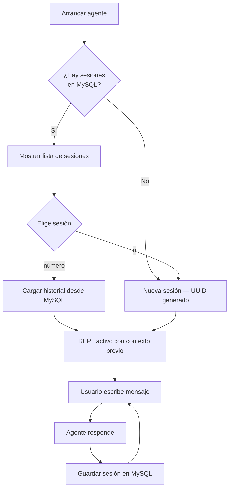

# Sesiones — Persistencia con MySQL

## Cómo funciona

Cada conversación con el agente es una **sesión** identificada por un UUID (`thread_id`). Al cerrar y volver a abrir el agente, puedes retomar cualquier sesión anterior con todo el historial de mensajes intacto.



## Esquema de la tabla `sessions`

```sql
CREATE TABLE sessions (
    id          VARCHAR(36)  PRIMARY KEY,   -- UUID de la sesión
    title       VARCHAR(255),               -- primer mensaje del usuario (auto)
    messages    LONGTEXT     NOT NULL,       -- JSON de todos los mensajes
    created_at  DATETIME     NOT NULL,
    updated_at  DATETIME     NOT NULL
) ENGINE=InnoDB DEFAULT CHARSET=utf8mb4;
```

## Estructura del JSON de mensajes

```json
[
  {
    "type": "human",
    "data": { "content": "cuanto es 7 al cuadrado?" }
  },
  {
    "type": "ai",
    "data": {
      "content": "",
      "tool_calls": [{ "name": "code_exec", "args": { "code": "print(7**2)" } }]
    }
  },
  {
    "type": "tool",
    "data": { "content": "49\n", "name": "code_exec" }
  },
  {
    "type": "ai",
    "data": { "content": "El resultado de 7 al cuadrado es 49." }
  }
]
```

## Comandos de sesión en el REPL

```
>>> nueva          # abre el selector de sesiones sin salir
>>> salir          # cierra el agente (la sesión ya está guardada)
```

## Consultar sesiones directamente en MySQL

```sql
-- Ver todas las sesiones
SELECT id, title, created_at, updated_at FROM dev_agent.sessions ORDER BY updated_at DESC;

-- Ver mensajes de una sesión específica
SELECT messages FROM dev_agent.sessions WHERE id = 'tu-uuid-aqui';

-- Contar mensajes en cada sesión (aproximado por ocurrencia de "type")
SELECT id, title, updated_at FROM dev_agent.sessions;
```

## Módulo de persistencia

```
agent/persistence/
└── mysql_store.py
    ├── init_db()              ← crea DB y tabla al arrancar
    ├── new_thread_id()        ← genera UUID v4
    ├── save_session(id, msgs) ← INSERT ... ON DUPLICATE KEY UPDATE
    ├── load_session(id)       ← retorna List[BaseMessage]
    └── list_sessions(limit)   ← últimas 20 sesiones por updated_at
```
