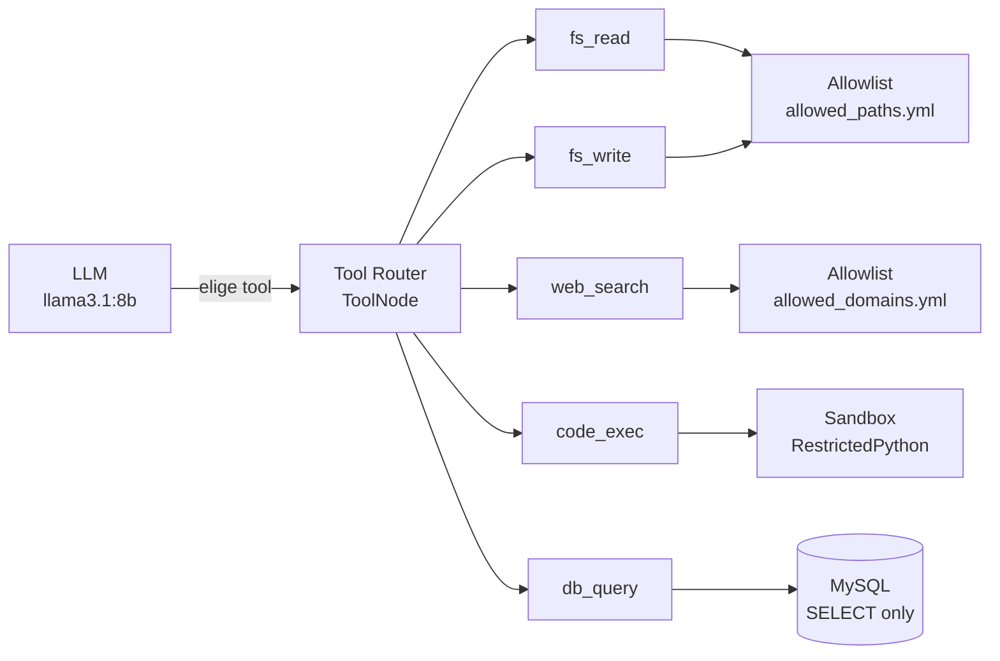

# Tools — Referencia completa

El agente tiene 4 tools registradas en `config/tools_manifest.yml`. Cada una pasa por el **auditor** antes de devolver el resultado.



---

## fs_read — Leer archivos

```python
fs_read(path: str) -> str
```

**Cuándo la usa el agente:** cuando el usuario pide leer o ver el contenido de un archivo.

**Restricciones:**
- El path debe ser relativo: `"./README.md"`, `"./wiki/01-arquitectura.md"`
- Solo puede acceder a paths en `config/allowed_paths.yml → read`
- Patrones denegados globalmente: `*.env`, `*.key`, `*.pem`, `*secret*`, `*credential*`

**Paths permitidos por defecto:**
```yaml
read:
  - .                        # directorio raíz del proyecto
  - ./examples
  - ./wiki
  - /tmp/agent-workspace
```

**Ejemplo de uso:**
```
>>> lee el archivo SECURITY.md y dame un resumen
```

---

## fs_write — Escribir archivos

```python
fs_write(path: str, content: str) -> str
```

**Cuándo la usa el agente:** cuando el usuario pide guardar código, generar un archivo o escribir texto.

**Restricciones:**
- Solo puede escribir en `config/allowed_paths.yml → write`
- Por defecto solo permite escribir en `/tmp/agent-workspace`

**Ejemplo de uso:**
```
>>> genera un script Python que calcule el factorial de n y guárdalo en /tmp/agent-workspace/factorial.py
```

---

## web_search — Buscar en la web

```python
web_search(url: str) -> str
```

**Cuándo la usa el agente:** cuando el usuario pide consultar documentación online.

**Restricciones:**
- Solo método GET — POST, PUT, DELETE bloqueados
- Solo dominios en `config/allowed_domains.yml`
- Timeout: 10 segundos
- Respuesta truncada a 3000 caracteres

**Dominios permitidos por defecto:**
```yaml
- docs.python.org
- pypi.org
- stackoverflow.com
- github.com
- developer.mozilla.org
- docs.anthropic.com
- docs.langchain.com
```

**Ejemplo de uso:**
```
>>> busca en docs.python.org/3/ qué es un generador en Python
```

---

## code_exec — Ejecutar código Python

```python
code_exec(code: str) -> str
```

**Cuándo la usa el agente:** cuando el usuario pide ejecutar lógica Python, hacer cálculos o demos.

**Restricciones (RestrictedPython 8.x):**
- `import` bloqueado — no puede importar módulos externos
- `open()` bloqueado — no puede acceder al filesystem directamente
- Timeout de 10 segundos via `ThreadPoolExecutor.result(timeout=10)`
- Output capturado via `PrintCollector` (solo lo que el código imprime)

**Lo que SÍ puede hacer:**
```python
# Cálculos
print(7 ** 2)

# Comprehensions y estructuras de datos
x = [i**2 for i in range(10)]
print(x)

# Lógica de control
for i in range(5):
    print(f"item {i}")
```

**Lo que NO puede hacer:**
```python
import os          # ImportError: __import__ not found
open("file.txt")   # bloqueado
while True: pass   # SandboxTimeoutError después de 10s
```

**Ejemplo de uso:**
```
>>> ejecuta este código: print([i for i in range(1, 6)])
```

---

## db_query — Consultar MySQL

```python
db_query(query: str) -> str
```

**Cuándo la usa el agente:** cuando el usuario pide consultar datos de la base de datos.

**Restricciones:**
- Solo queries que empiecen con `SELECT` (regex `^\s*SELECT\b`)
- Máximo 50 filas por resultado (`fetchmany(50)`)
- Conecta a la DB configurada en variables de entorno `MYSQL_*`

**Ejemplo de uso:**
```
>>> cuántas sesiones tengo guardadas en la tabla sessions?
```

```sql
-- El agente genera y ejecuta:
SELECT COUNT(*) FROM sessions
-- Resultado: [{'COUNT(*)': 4}]
```

---

## Habilitar / deshabilitar tools

Edita `config/tools_manifest.yml` y cambia `enabled`:

```yaml
tools:
  web_tool:
    enabled: false   # ← deshabilita web_search sin tocar código
```

El cambio aplica en el próximo arranque del agente.
