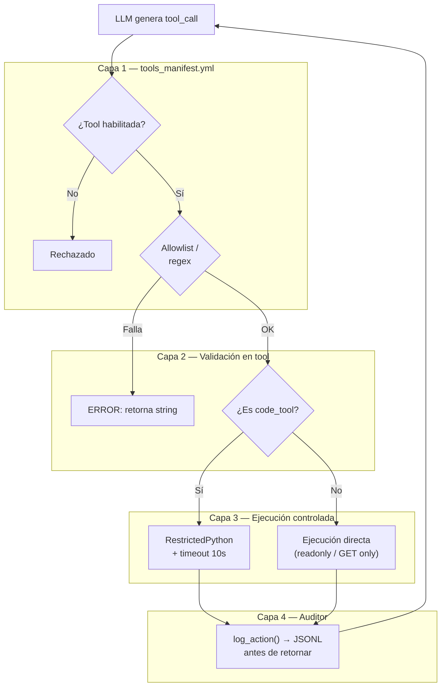
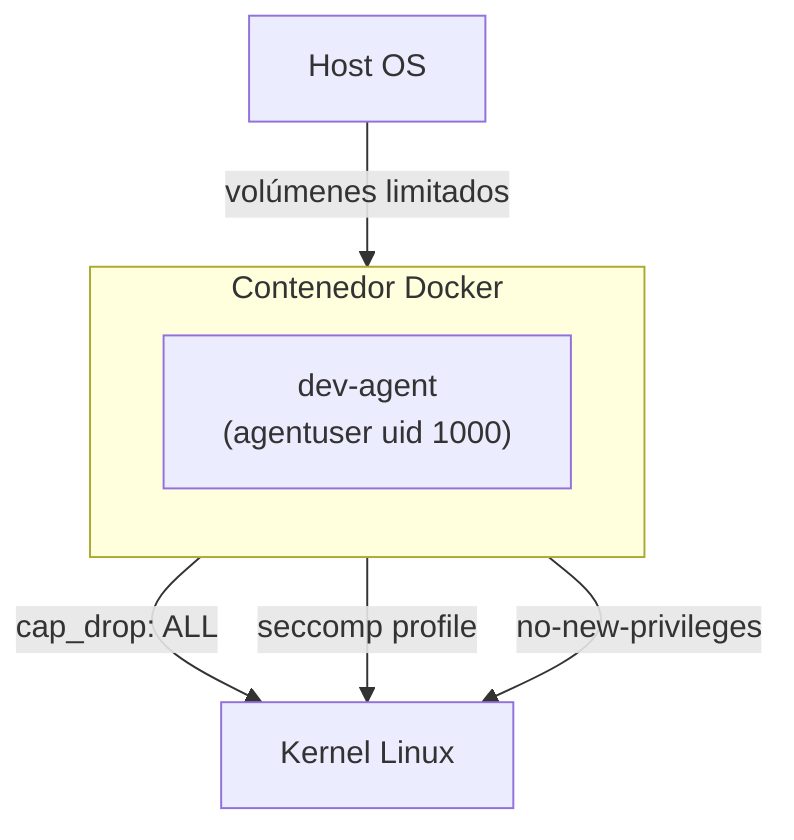

# Modelo de seguridad

## Capas de defensa



---

## Por tool

### fs_tool

| Control | Detalle |
|---|---|
| Allowlist de paths | `config/allowed_paths.yml` — solo paths declarados |
| Patrones denegados | `*.env`, `*.key`, `*.pem`, `*secret*`, `*credential*` |
| Escritura restringida | Solo en `/tmp/agent-workspace` por defecto |
| Path traversal | `Path.resolve()` antes de comparar — bloquea `../../etc/passwd` |

### web_tool

| Control | Detalle |
|---|---|
| Allowlist de dominios | `config/allowed_domains.yml` |
| Métodos bloqueados | POST, PUT, DELETE, PATCH — solo GET |
| Timeout | 10 segundos por request |
| Tamaño de respuesta | Truncado a 3000 caracteres |

### code_tool

| Control | Detalle |
|---|---|
| RestrictedPython 8.x | Compila a bytecode restringido — bloquea `import`, `open`, `exec` |
| Timeout | 10 segundos via `ThreadPoolExecutor.result(timeout=10)` |
| Sin acceso a red | `urllib`, `requests`, `httpx` no disponibles en sandbox |
| Sin filesystem | `open()` no disponible en el contexto restringido |
| Output controlado | Solo captura lo que `print()` genera via `PrintCollector` |

### db_tool

| Control | Detalle |
|---|---|
| Solo SELECT | Regex `^\s*SELECT\b` — rechaza INSERT, UPDATE, DELETE, DROP |
| Límite de filas | `fetchmany(50)` — no puede extraer tablas completas |
| Conexión MySQL | Usuario configurado por env vars — aplicar principio de menor privilegio |

---

## Audit log

Cada acción del agente genera una entrada en `/tmp/agent-audit/audit.jsonl`:

```json
{
  "timestamp": "2026-03-22T22:47:13.104127+00:00",
  "tool": "code_tool",
  "action": "exec",
  "input": { "code_preview": "print(10 * 5)" },
  "result_preview": "50\n",
  "error": null,
  "status": "ok"
}
```

El log se escribe **antes** de retornar el resultado al LLM.

Para monitorear en tiempo real:

```bash
# Linux / Mac
tail -f /tmp/agent-audit/audit.jsonl | python -m json.tool

# Windows (PowerShell)
Get-Content /tmp/agent-audit/audit.jsonl -Wait
```

---

## Ejecución en Docker (capa adicional)



Controles del contenedor (`docker/docker-compose.yml`):
- Usuario no-root: `agentuser` (uid 1000)
- `cap_drop: ALL` — sin capacidades Linux
- `no-new-privileges: true`
- Perfil seccomp en `docker/seccomp-profile.json`
- Volúmenes separados para workspace y audit

---

## Recomendaciones adicionales

1. **Usuario MySQL de menor privilegio** — crea un usuario con solo `SELECT` en las tablas que necesita, en lugar de `root`
2. **Agregar dominios con cuidado** — cada dominio en `allowed_domains.yml` es una superficie de ataque potencial
3. **Rotar el audit log** — configura `logrotate` en producción para `/tmp/agent-audit/audit.jsonl`
4. **Limitar paths de escritura** — en producción, el workspace debería estar fuera del directorio del proyecto
